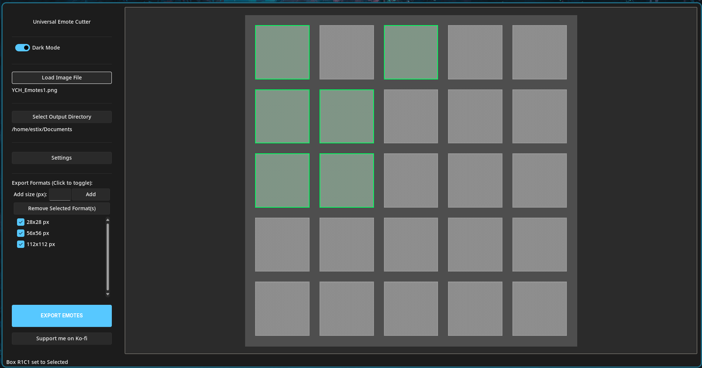

# Universal Emote Cutter (UEC)

A simple desktop tool for artists and streamers to quickly cut out emotes from a single grid image (spritesheet) and export them to multiple sizes.

---

---

## 🚀 Getting Started

No installation required!

1.  Go to the [**Releases**](https://github.com/Estix0/Universal-Emote-Cutter/releases) tab in this repository.
2.  Download the `UEC.exe` from the latest release.
3.  Run the file. The app will automatically save its settings in your user's `AppData` folder.

## ✨ Features

* **Visual Grid:** Load your emote sheet and see an adjustable grid overlay.
* **Advanced Grid Control:** Set rows, columns, and custom padding and borders (as a single value or for each side individually).
* **Flexible Export:**
    * Add or remove any number of export sizes (e.g., `112x112`, `56x56`, `28x28`).
    * Select multiple formats from the list to export at the same time.
* **Click to Select:** Simply click the grid cells you want to export.
* **Persistent Settings:** The app saves all your grid, export size, and language settings automatically.
* **Multi-language:** Supports English and Polish (Polski).

## ☕ Support Me

If this tool saved you some time, please consider supporting my work!

